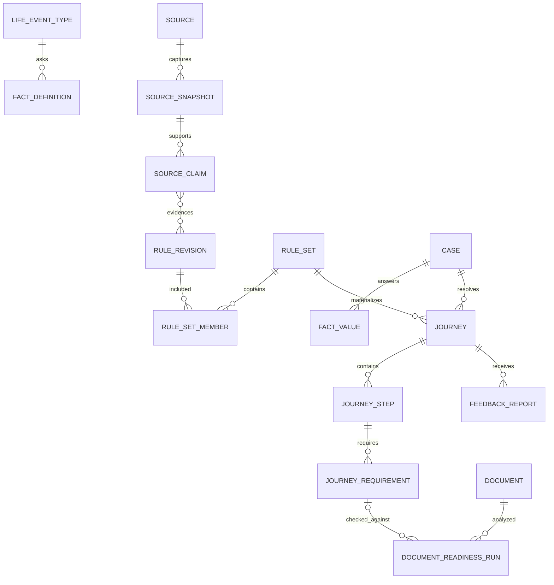

# ERD — conceptual

```mermaid
erDiagram
  LIFE_EVENT_TYPE ||--o{ FACT_DEFINITION : asks
  SOURCE ||--o{ SOURCE_SNAPSHOT : captures
  SOURCE_SNAPSHOT ||--o{ SOURCE_CLAIM : supports
  SOURCE_CLAIM }o--o{ RULE_REVISION : evidences
  RULE_SET ||--o{ RULE_SET_MEMBER : contains
  RULE_REVISION ||--o{ RULE_SET_MEMBER : included
  CASE ||--o{ FACT_VALUE : answers
  CASE ||--o{ JOURNEY : resolves
  RULE_SET ||--o{ JOURNEY : materializes
  JOURNEY ||--o{ JOURNEY_STEP : contains
  JOURNEY_STEP ||--o{ JOURNEY_REQUIREMENT : requires
  DOCUMENT ||--o{ DOCUMENT_READINESS_RUN : analyzed
  JOURNEY_REQUIREMENT o|--o{ DOCUMENT_READINESS_RUN : checked_against
  JOURNEY ||--o{ FEEDBACK_REPORT : receives
```

Vezi migrations pentru schema normativă.
